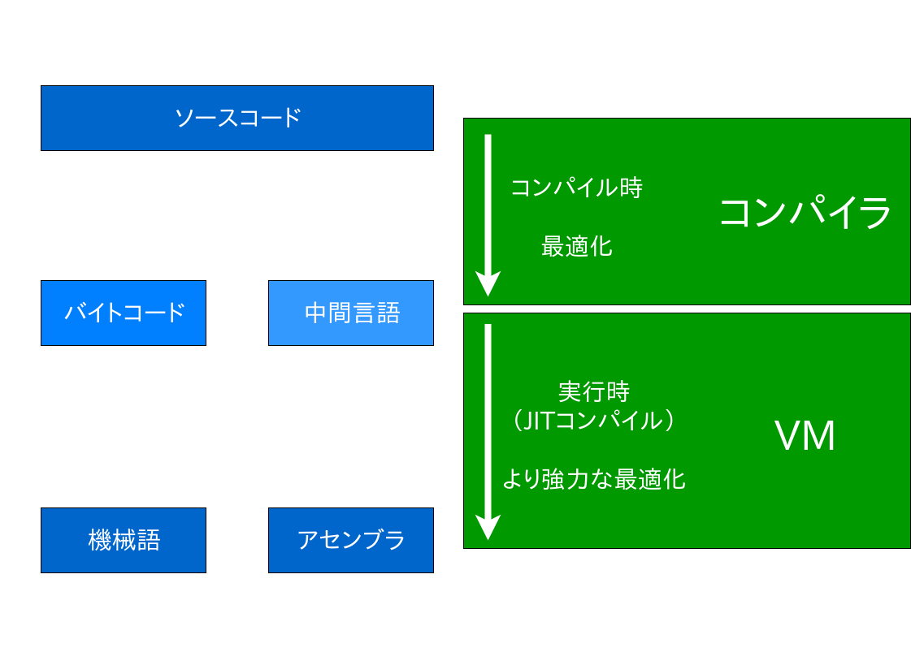
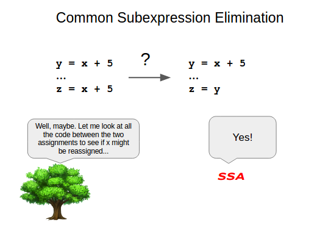
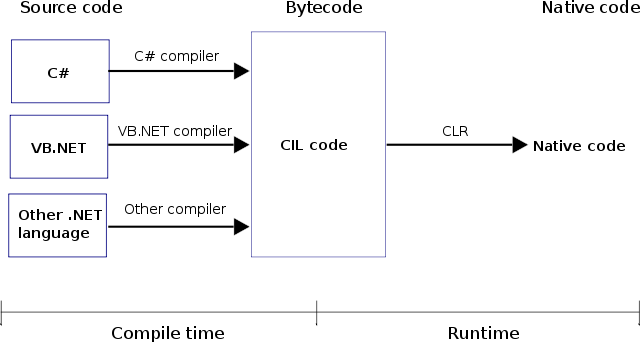
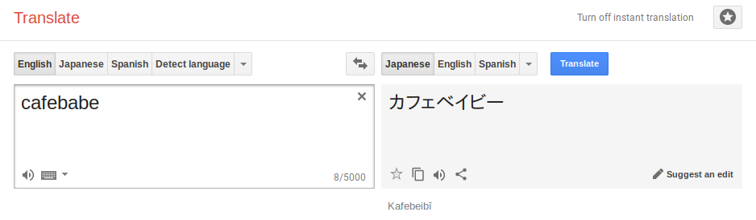
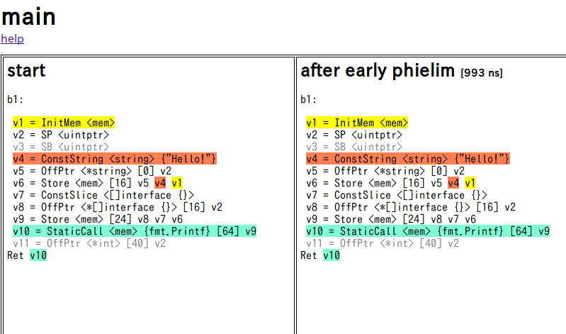
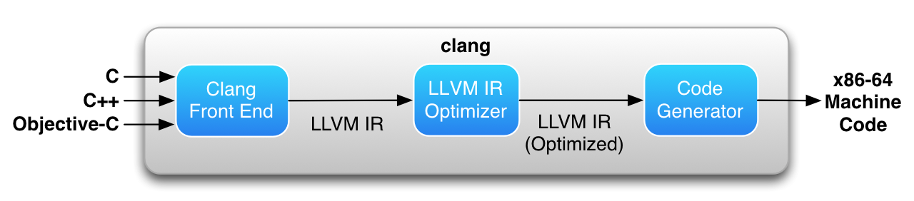
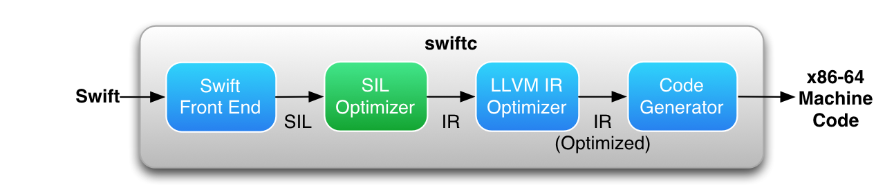
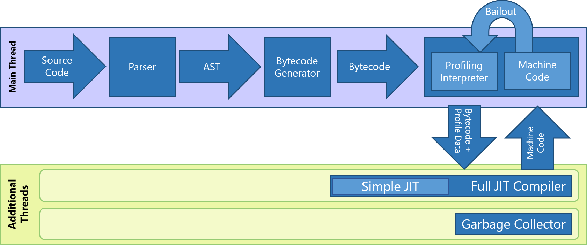

<!-- .slide: class="center" -->
# ノリで読む中間言語

sei0o inoue

---

## 誰

<div class="twocol">
  <div>
    
  </div>
  <div>
    <ul style="margin-top: 10px">
      <li>sei0o inoue ([@sei0o](http://twitter.com/sei0o))</li>
      <li>明石高専 2E</li>
      <li>[o0i.es](http://o0i.es)</li>
      <li>RubyとかCTFとか広く浅く</li>
      <li>春休みは遊んでました！w</li>
  </div>
</div>

---

## Agenda

- 最近の処理系
- What is 中間言語?
- Why use 中間言語?
- 基礎知識
- 読んでみる!

---

## 最近の処理系
- コンパイル言語・スクリプト言語
- 分け方の一つであって、実装はどちらでもよい
- VM
  - Ruby → YARV
  - PHP → HHVM (Hack)

---

図(コンパイラ vs VM(JITコンパイラ + ランタイム))

---

## What is 中間言語？

- ソースコードを機械語にコンパイルする際に間に挟む言語
- ここではIR (Intermediate Representation)やバイトコードも含めちゃいます

---



---

## どこで使うの？

- .NET (C#)
- JVM (Java, Kotlin)
- Go
- LLVM
- V8, Chakra (JavaScript)
- Python
- Ruby (コンパイラと密結合)

---

## Why use 中間言語?
- アセンブラはしんどい
  - 命令が細かすぎる
  - アーキテクチャへの依存性が高い

```asm
push ebp
mov ebp, esp
sub esp, 0x40
```

- コードの最適化
  - 命令数を減らして高速に

---

## 最適化
- Dead Code Elimination
- Common Subexpression Elimination
- Bounds Check Elimination

---

## 静的単一代入 (SSA)
- 各変数への代入は1回→依存関係が明快に
- Φ (phi) 関数という考え方

<div class="twocol" style="font-size: 130%">
  <code><pre>
a = x + y
if (a > 2) {
  a = a - 2
} else {
  a = a + 3
}
print(a)
  </pre></code>
  <code><pre>
a1 = x1 + y1
if (a1 > 2) {
  <span class="fragment highlight-red" data-fragment-index="1">a2 = a1 - 2 <span class="fragment" data-fragment-index="1">(#1)</span></span>
} else {
  <span class="fragment highlight-blue" data-fragment-index="1">a3 = a1 + 3 <span class="fragment" data-fragment-index="1">(#2)</span></span>
}
<span class="fragment" data-fragment-index="2">a4 = φ(<span class="pink">#1 -> a2</span>, <span class="blue">#2 -> a3</span>)</span>
print(<span class="fragment" data-fragment-index="2">a4</span>)
  </pre></code>
</div>  

---


<small>[Generating Better Machine Code with SSA](https://about.sourcegraph.com/go/generating-better-machine-code-with-ssa/)より引用</small>

---

## 読んでみる

- 言語の解説
- 実行までの道のり
- ソースコードと中間言語/バイトコードの比較
- ノリ・気合・Google

---

## .NET (C#, F#)
- Windowsアプリ?
- CIL (Common Intermediate Language) / MSIL
- CLR (Common Language Runtime)
- 2つの血筋
  - .NET Framework → Windows
  - Mono → Linuxなど (今回はこっちを利用)
- 逆コンパイル (ILSpyなど)

--

- [.NET Core / .NET Framework / Xamarin / Monoの関係を整理する](http://ascii.jp/elem/000/001/156/1156721/)

- .NET NativeというAOTコンパイラもあるらしい
<small>[Introducing .NET Standard](https://blogs.msdn.microsoft.com/dotnet/2016/09/26/introducing-net-standard/)より引用</small>

---

### 構成


<small>Wikipediaより引用, CC-BY-SA Rursus</small>

---

<div class="twocol">
  <code><pre>
using System;

class <span class="blue">MainClass</span> {
  public static <span class="blue">void Main(string[] args)</span> {
    <span class="pink">Console.WriteLine(<span class="orange">"Hello!"</span>);</span>
  }
}

// 生成方法
// $ mcs hello.cs
// $ monodis hello.exe --output=hello.il
  </pre></code>
  <code><pre>
.class private auto ansi beforefieldinit <span class="blue">MainClass</span>
  extends [mscorlib]System.Object {

  <span class="green">// コンストラクタ
  .method public hidebysig specialname rtspecialname instance default void '.ctor' () cil managed {
    ...
  }</span>

  .method public static hidebysig default <span class="blue">void Main (string[] args)</span> cil managed {
    .entrypoint
    .maxstack 8
    IL_0000:  ldstr <span class="orange">"Hello!"</span>
    IL_0005:  call void class [mscorlib]<span class="pink">System.Console::WriteLine(string)</span>
    IL_000a:  ret
  }

}
  </pre></code>
</div>

---

## 最適化
- [The Mono JIT](http://www.mono-project.com/docs/advanced/runtime/jitslides/)

---

## JVM (Java)
- "Write Once, Run Anywhere"
- HotSpot
- Clojure, Scala, Kotlinなど → バイトコードを生成
- JRubyなど → JVM上でそのまま動作

---

<div class="twocol">
  <code><pre style="width: 35vw">
public class HelloTest {
  public static void main() {
    <span class="pink">System.out</span>.<span class="blue">println</span>(<span class="green">"Hello!"</span>);
  }
}

// 生成方法
// $ javac HelloTest.java
// $ javap -v HelloTest.class >> HelloTest_bytecode.txt
  </pre></code>
  <code><pre style="width: 65vw; margin-left: -10vw;">
Constant pool:
  <span class="orange">#1 = Methodref #6.#14
    // java/lang/Object."&lt;init&gt;":()V
    // コンストラクタ</span>
  <span class="fragment highlight-red" data-fragment-index="4">#2 = Fieldref #15.#16</span>
  <span class="fragment highlight-green" data-fragment-index="1">#3 = String #17</span>
  <span class="fragment highlight-blue" data-fragment-index="7">#4 = Methodref #18.#19
    <span class="fragment blue" data-fragment-index="7">// java/io/PrintStream.println:(Ljava/lang/String;)V
    // (L java/lang/String;)V → Stringを受け取ってVoidを返す？</span></span>
  #11 = Utf8 main
  <span class="fragment highlight-red" data-fragment-index="3">#15 = Class #22 <span class="fragment pink" data-fragment-index="3">// System</span>
  #16 = NameAndType #23:#24 <span class="fragment pink" data-fragment-index="3">// out:Ljava/io/PrintStream;
    // System.outはPrintStreamのインスタンス？</span></span>
  <span class="green">#17 = Utf8 Hello!</span>
  <span class="fragment highlight-blue" data-fragment-index="8">#18 = Class #25</span>
  <span class="fragment highlight-blue" data-fragment-index="6">#19 = NameAndType #26:#27 <span class="fragment blue" data-fragment-index="6">// println:(Ljava/lang/String;)V</span></span>
  #20 = Utf8 HelloTest
  <span class="fragment highlight-red" data-fragment-index="2">#22 = Utf8 java/lang/System
  #23 = Utf8 out</span>
  <span class="fragment highlight-red" data-fragment-index="3">#24 = Utf8 Ljava/io/PrintStream;</span>
  <span class="fragment highlight-blue" data-fragment-index="9">#25 = Utf8 java/io/PrintStream</span>
  <span class="fragment highlight-blue" data-fragment-index="5">#26 = Utf8 println</span>
  <span class="fragment highlight-blue" data-fragment-index="6">#27 = Utf8 (Ljava/lang/String;)V</span>
  </pre></code>
</div>

---

<div class="twocol">
  <code><pre style="width: 30vw;">
<span class="orange">#1 = コンストラクタ</span>
#2 = Fieldref System.out
#3 = String "Hello!"
#4 = Methodref
  PrintStream.println
  </pre></code>
  <code><pre style="width: 70vw; margin-left: -20vw;">
public HelloTest();
  descriptor: ()V
  Code:
    stack=1, locals=1, args_size=1
        0: aload_0
        1: <span class="orange">invokespecial #1</span>
        4: return
    LineNumberTable:
      line 1: 0

public static void main();
  descriptor: ()V
  Code:
    stack=2, locals=0, args_size=0
        0: <span class="fragment highlight-current-red">getstatic     #2</span>
        3: <span class="fragment highlight-current-red">ldc           #3</span>
        5: <span class="fragment highlight-current-red">invokevirtual #4</span>
        8: <span class="fragment highlight-current-red">return</span>
  </pre></code>
</div>

---

### ちなみに
- バイトコードを含んだ`.class`ファイルをバイナリエディタで見ると...

<code>
<pre>
  Offset: 00 01 02 03 04 05 06 07 08 09 0A 0B 0C 0D 0E 0F 	
00000000: <span class="fragment highlight-red">CA FE BA BE</span> 00 00 00 35 00 1C 0A 00 06 00 0E 09
</pre>
</code>

<div class="fragment">

</div>

---

## Go

<div class="twocol">
  <div style="width:40%">
    
    Gopherくん
  </div>
  <div>
    <ul>
      <li>並列処理が得意</li>
      <li><strong>SSA</strong>ベースの最適化
        <ul>
          <li>1.6までAST(構文木)ベース</li>
        </ul>
      </li>
    </ul>
  </div>
</div>

<small>The Go gopher was designed by Renée French.</small>

---

### コンパイル

- `$ GOSSAFUNC=main go build`
- なんかいろいろ生成してくれる



---

### 最適化の全体像

- [compile.go](https://github.com/golang/go/blob/master/src/cmd/compile/internal/ssa/compile.go#L331)からスタート
- 43ステップ

```
{name: "early phielim", fn: phielim},
{name: "early copyelim", fn: copyelim},
{name: "early deadcode", fn: deadcode}, 
{name: "short circuit", fn: shortcircuit},
{name: "decompose user", fn: decomposeUser, required: true},
{name: "opt", fn: opt, required: true},
{name: "zero arg cse", fn: zcse, required: true},
{name: "opt deadcode", fn: deadcode, required: true},
{name: "generic cse", fn: cse},
{name: "phiopt", fn: phiopt},
{name: "nilcheckelim", fn: nilcheckelim},
{name: "prove", fn: prove},
...
```
---

### 最適化の例: opt
- [opt](https://github.com/golang/go/blob/master/src/cmd/compile/internal/ssa/opt.go) ステップから呼び出される[generic.rules](https://github.com/golang/go/blob/master/src/cmd/compile/internal/ssa/gen/generic.rules) (1200行ぐらい)
  - 実際はこの内容がGoのコードに変換されている(30000行)

```
// Convert x * 1 to x.
(Mul(8|16|32|64) (Const(8|16|32|64) [1]) x) -> x
```

```
// fold negation into comparison operators
(Not (Eq(64|32|16|8|B) x y)) -> (Neq(64|32|16|8|B) x y)
(Not (Neq(64|32|16|8|B) x y)) -> (Eq(64|32|16|8|B) x y)
```

- φ関数

```
// basic phi simplifications
(Phi (Const8  [c]) (Const8  [c])) -> (Const8  [c])
(Phi (Const16 [c]) (Const16 [c])) -> (Const16 [c])
(Phi (Const32 [c]) (Const32 [c])) -> (Const32 [c])
(Phi (Const64 [c]) (Const64 [c])) -> (Const64 [c])
```

---

### 最適化の例

- 定数をカッコの外に出す

```
// x + (C + z) -> C + (x + z)
(Add64 (Add64 i:(Const64 <t>) z) x) 
  && (z.Op != OpConst64 && x.Op != OpConst64)
 -> (Add64 i (Add64 <t> z x))
```

- if文の省略

```
(If (Not cond) yes no) -> (If cond no yes)
(If (ConstBool [c]) yes no) && c == 1 -> (First nil yes no)
(If (ConstBool [c]) yes no) && c == 0 -> (First nil no yes)
```

---

### 最適化の例

- こんな記述が…

<code class="hljs lisp">
<pre>
// strength reduction of divide by a constant.
// See <em>../magic.go</em> for a detailed description of these algorithms.
</pre>
</code>
<br>

- [magic.go](https://github.com/golang/go/blob/master/src/cmd/compile/internal/ssa/magic.go)を見てみる
- 定数での除算を乗算に置き換える
  - CPUの除算は乗算に比べて遅い

<code>
<pre>
// Machine <em>division instructions are slow</em>, so we try to
// compute this division with a multiplication + a few
// other cheap instructions instead.
</pre>
</code>

---

### magic?

```
//   ⎣x * m / 2^e⎦
// Which we want to be equal to ⎣x / c⎦ for 0 <= x < 2^n-1
// where n is the word size.
// Setting x = c gives us c * m >= 2^e.
// We'll chose m = ⎡2^e/c⎤ to satisfy that equation.
// What remains is to choose e.
// Let m = 2^e/c + delta, 0 <= delta < 1
//   ⎣x * (2^e/c + delta) / 2^e⎦
//   ⎣x / c + x * delta / 2^e⎦
// We must have x * delta / 2^e < 1/
```

- よく見るとただの式変形
- 本題とはずれるので説明はしません

---

### 最適化の例: Dead Code Elimination

- 絶対に実行されないコードを取り除く

```go
func main() {
	x := 3

	if x > 10 { 
		fmt.Printf("X is greater than 10") // dead code
	}
}
```

---

### 最適化の例: Dead Code Elimination
- [deadcode.go](https://github.com/golang/go/blob/master/src/cmd/compile/internal/ssa/deadcode.go)
- コメントがていねい→**読める!**
  - 先頭のブロックから
- この例ではgeneric.rulesで自明な条件分岐を書き換えた後、DCEでいらない部分を除去している(→合わせ技！)
  - BlockIf → BlockFirst

---

### 最適化の例
- [ssa/gen/](https://github.com/golang/go/tree/master/src/cmd/compile/internal/ssa/gen)にはアーキテクチャ個々についての最適化も
  - x86
  - ARM
  - MIPS

---

<!-- golang SSA BlockIf -->
<!-- Func, Block(Preds, Succs), Value, OpGreaterなどの簡単な説明 -->

---

<!-- opt: BlockFirstに変える -->

---

<!-- deadcode: reachable blocksをDFSで求め、 Live valuesをなんとかして（調べる）見つける、

- live values
  - Block.Control (Value) ならばlive
    - // A value that determines how the block is exited. (block.go)
  - Value.Opがcall / hasSideEffects ならばlive
  - Value.TypeがVoidならばlive ←　なぜ？
    - // The only Void ops are nil checks.  We must keep these.
    - nil checkはどこで生成される？（おそらくif val != nilのことではない)
  - Value.Op == OpPhiのとき、すべてのArgs(Value型) = ブロックのPredsがun-reachableのとき、Valueを削除する

dead codeの除去, transitive closureを求めるのにwarshall-floydが使える話 -->

---

## LLVM

<div class="twocol">
  <div style="width:50%">
    
    <del>ちょっとこわい</del>
  </div>
  <div>
    <ul>
      <li>「コンパイラ基盤」
        <ul>
          <li>VMではない</li>
        </ul>
      </li>
      <li>「巨人の肩に乗る」</li>
      <li>[scratch86](https://github.com/bobbybee/scratch86)</li>
    </ul>
  </div>
</div>

<small>[LLVM公式サイト](https://llvm.org/)より</small>

---

### LLVM (C, C++)
- clangから利用される
  - Apple謹製



<small>[OS X 10.10 Yosemite: The Ars Technica Review](https://arstechnica.com/gadgets/2014/10/os-x-10-10/22/)より引用</small>

---

<div class="twocol">
  <code><pre>
<span class="orange">#include &lt;stdio.h&gt;</span>

<span class="blue">int main ()</span> { // テストで減点されます
  <span class="fragment highlight-current-red" data-fragment-index="1">printf(</span><span class="green">"Hello!"</span><span class="fragment highlight-current-red" data-fragment-index="1">)</span>;
  <span class="fragment highlight-current-red" data-fragment-index="2">return 0;</span>
}

// 生成方法
// $ clang -S -emit-llvm hello.c -o hello.ll

// LLVM IR → 実行形式
// $ clang hello.ll
  </pre></code>
  <code><pre>
<span class="green">@.str = private unnamed_addr constant [7 x i8] c"Hello!\00", align 1</span>

<span class="blue">define i32 @main(i32, i8\*\*) #0</span> {
  ; 消しても動いた
  ; %1 = alloca i32, align 4
  ; store i32 0, i32\* %1, align 4
  %1 = <span class="fragment highlight-current-red" data-fragment-index="1">call i32 (i8\*, ...) @printf(i8\* getelementptr inbounds ([7 x i8], [7 x i8]\* <span class="fragment highlight-current-green" data-fragment-index="1">@.str</span>, i32 0, i32 0))</span>
  <span class="fragment highlight-current-red" data-fragment-index="2">ret i32 0</span>
}

<span class="orange">// あとからリンクする?
declare i32 @printf(i8\*, ...) #1</span>
  </pre></code>
</div>

---

### LLVM (Swift)
- iOSアプリ開発に利用
- swiftcから利用される
- SIL + LLVM IR の2段階戦略



<small>[OS X 10.10 Yosemite: The Ars Technica Review](https://arstechnica.com/gadgets/2014/10/os-x-10-10/22/)より引用</small>

---

### Swift → raw SIL

<div class="twocol">
  <code><pre style="width:30vw">
print("Hello!")

// 生成方法
// $ swiftc -emit-silgen hello.swift -o hello-raw.sil

// 57行
  </pre></code>
  <code><pre style="width: 70vw; left: 20vw;">
<span class="fragment highlight-green" data-fragment-index="6">// %7, %12: 確保したメモリ領域(雑)
%12</span> = init_existential_addr %11 : $\*Any, $String
<span class="orange">%13</span> = string_literal utf8 <span class="green">"Hello!"</span>
<span class="orange">%14</span> = integer_literal $Builtin.Word, 6
<span class="orange">%15</span> = integer_literal $Builtin.Int1, -1
<span class="orange">%16</span> = metatype $@thin String.Type

// function\_ref <span class="fragment highlight-red" data-fragment-index="1">String.init(_builtinStringLiteral:utf8CodeUnitCount:isASCII:)</span>
%17 = <span class="orange">function_ref</span> @\_T0S2SBp21<span class="fragment highlight-red" data-fragment-index="2">\_builtinStringLiteral</span>\_Bw17<span class="fragment highlight-red"  data-fragment-index="2">utf8CodeUnitCount</span>Bi1_7is<span class="fragment highlight-red" data-fragment-index="2">ASCII</span>tcfC
  <span class="fragment highlight-blue" data-fragment-index="4">: $@convention(method) (Builtin.RawPointer, Builtin.Word, Builtin.Int1, @thin String.Type)
  <span class="fragment highlight-blue" data-fragment-index="3">-> @owned String</span></span>
%18 = <span class="orange">apply %17(%13, %14, %15, %16)</span>
  <span class="fragment highlight-blue" data-fragment-index="5">: $@convention(method) (Builtin.RawPointer, Builtin.Word, Builtin.Int1, @thin String.Type)
  -> @owned String</span>
store %18 to [init] <span class="fragment highlight-green" data-fragment-index="6">%12</span> : $*String
  </pre></code>
</div>

---

### Swift → raw SIL

<div class="twocol">
  <code><pre style="width:30vw">
print("Hello!")
  </pre></code>
  <code><pre style="width: 70vw; left: 20vw;">
// function\_ref <span class="fragment highlight-red" data-fragment-index="1">print(_:separator:terminator:)</span>
%24 = <span class="orange">function_ref</span> @\_T0s5<span class="fragment highlight-red" data-fragment-index="1">print</span>yypd_SS9<span class="fragment highlight-red" data-fragment-index="1">separator</span>SS10<span class="fragment highlight-red" data-fragment-index="1">terminator</span>tF
  <span class="fragment highlight-blue" data-fragment-index="2">: $@convention(thin) (@owned Array&lt;Any&gt;, @owned String, @owned String)
  -> ()</span>
%25 = <span class="orange">apply %24(%7, %21, %23)</span>
  <span class="fragment highlight-blue" data-fragment-index="2">: $@convention(thin) (@owned Array&lt;Any&gt;, @owned String, @owned String)
  -> ()</span>

%26 = integer_literal $Builtin.Int32, 0
%27 = struct $Int32 (%26 : $Builtin.Int32) 
<span class="fragment highlight-red" data-fragment-index="3">return %27 : $Int32</span>
  </pre></code>
</div>


---

### raw SIL → Canonical SIL
- さらなる最適化
- 350行程度に
- String.initの呼び出し→直接StringCoreを作成

<div>
  <code><pre style="position:absolute; left: -10px;">
%16 = init_existential_addr %15 : $\*Any, $String

%17 = string_literal utf8 <span class="green">"Hello!"</span>
%18 = struct $UnsafeMutableRawPointer (%17 : $Builtin.RawPointer)
%19 = enum $Optional<UnsafeMutableRawPointer>, #Optional.some!enumelt.1, %18 : $UnsafeMutableRawPointer
%20 = integer_literal $Builtin.Int64, 6
%21 = enum $Optional<AnyObject>, #Optional.none!enumelt
%22 = struct $UInt (%20 : $Builtin.Int64)
%23 = <span class="pink">struct $_StringCore</span> (%19 : $Optional<UnsafeMutableRawPointer>, %22 : $UInt, %21 : $Optional<AnyObject>)
%24 = <span class="pink">struct $String</span> (%23 : $_StringCore)

store %24 to %16 : $*String
  </pre></code>
</div>

---

### Canonical SIL → LLVM IR
- 140行程度
- わかりません たすけて

<div>
  <code><pre>
// $ swiftc -O -emit-ir hello.swift -o hello.ll

%35 = call swiftcc { i64, i64, i64 } @\_T0s5<span class="pink">print</span>yypd\_SS9<span class="pink">separator</span>SS10<span class="pink">terminator</span>FfA0\_()
%36 = extractvalue { i64, i64, i64 } %35, 0
%37 = extractvalue { i64, i64, i64 } %35, 1
%38 = extractvalue { i64, i64, i64 } %35, 2
%39 = call swiftcc { i64, i64, i64 } @\_T0s5<span class="pink">print</span>yypd\_SS9<span class="pink">separator</span>SS10<span class="pink">terminator</span>FfA1\_()
%40 = extractvalue { i64, i64, i64 } %39, 0
%41 = extractvalue { i64, i64, i64 } %39, 1
%42 = extractvalue { i64, i64, i64 } %39, 2
call swiftcc void @\_T0s5<span class="pink">print</span>yypd_SS9<span class="pink">separator</span>SS10<span class="pink" >terminator</span>F(%Ts27_ContiguousArrayStorageBaseC* %26, i64 %36, i64 %37, i64 %38, i64 %40, i64 %41, i64 %42)
<em>ret i32 0</em>
  </pre></code>
</div>

---

## GCC (C)
- [?](ftp://gcc.gnu.org/pub/gcc/summit/2003/Tree%20SSA%20-%20A%20New%20optimization%20infrastructure.pdf)
- [GCC internals](https://gcc.gnu.org/onlinedocs/gccint/index.html#Top)

---

## V8 (JavaScript)
- Chromeに積まれている
- Ignition

---

## Chakra (JavaScript)
- Edgeに積まれている



<small>[Architecture Overview - Microsoft/ChakraCore Wiki](https://github.com/Microsoft/ChakraCore/wiki/Architecture-Overview/)より引用</small>


---

## アーキテクチャごとの最適化

---

## まとめ
- 中間言語は楽しい!!
- コンパイラは案外読める!!
  - 書ける...?
- 工夫がすごい!!

---

## 参考資料
- SSA
  - [静的単一代入最適化部](http://www.is.titech.ac.jp/~sassa/coins-www-ssa/japanese/)
    - なぜか東工大の文書がよく引っかかる
  - [Static Single Assignment for Decompilation](https://yurichev.com/mirrors/vanEmmerik_ssa.pdf)
- Go
  - []
- JVM
  - [JVM performance optimization | JavaWorld](https://www.javaworld.com/article/2078623/core-java/jvm-performance-optimization-part-1-a-jvm-technology-primer.html)
- LLVM
  - [LLVMを始めよう！ 〜 LLVM IRの基礎はclangが教えてくれた・Brainf**kコンパイラを作ってみよう 〜](https://itchyny.hatenablog.com/entry/2017/02/27/100000)
  - [Kaleidoscope](https://llvm.org/docs/tutorial/) コンパイラ自作のチュートリアル
  - [LLVM Language Reference Manual](https://llvm.org/docs/LangRef.html)
- SIL
  - 作成時はSwift 4.1が最新です
  - [Swift中間言語の、ひとまず入り口手前まで](https://qiita.com/es_kumagai/items/b0b123526329909ae2a2)
    - Swift 3だが、サクっと読める
  - [Swiftの中間言語SILを読む](https://blog.waft.me/2018/01/09/swift-sil-1/)
    - 2018年になってからなので結構新しい
  - [GitHub: swift/docs/SIL.rst](https://github.com/apple/swift/blob/master/docs/SIL.rst)
  - [新しい予約語がやってくる 「Swift5のOwnershipに備える」 #tryswiftconf](https://dev.classmethod.jp/event/try-swift-2018-ownership-on-swift5/)
    - Swiftは開発が速い
- ChakraCore
  - [Chakra JIT CFP Bypass](http://theori.io/research/chakra-jit-cfg-bypass)
- BEAM
  - [A peak into the Erlang compiler and BEAM bytecode](http://gomoripeti.github.io/beam_by_example/)
- Rust
  - MIR/HIR
  - [Introducing MIR](https://blog.rust-lang.org/2016/04/19/MIR.html)

---

<!-- .slide: class="center" -->
おしまい  
- [ソースコードも読んで]()
  - Swiftはめっちゃ省いてます